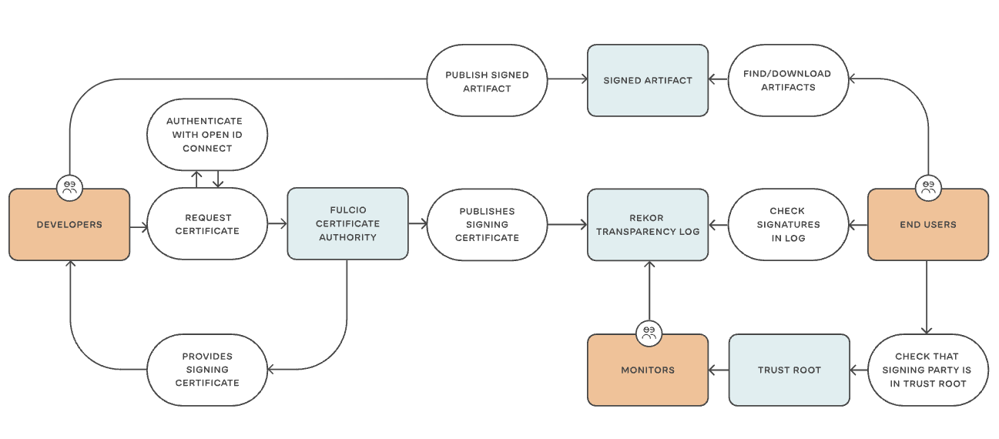

title = "SIP 012 - "Signing the Spin releases"
template = "main"
date = "2023-03-01T01:01:01Z"

---

Summary: This improvement proposal describes the reasoning and implementation
for signing Spin releases.

Owners: radu@fermyon.com

Created: March 2, 2023

## Background

Signing release artifacts for software offers a way for consumers of the software
to verify the integrity of the package they downloaded. The signature should
offer two guarantees: the author of the artifact is indeed the one expected by
the consumer, and the content of the artifact has not been tampered with since
its creation.

The goal of this SIP is to define the tools used for generating signatures for
the Spin project, and to provide a standard process for signing release artifacts
for Spin and related projects.

## Proposal

This SIP proposes that for every [Spin release](https://github.com/fermyon/spin/releases),
we add metadata that helps a user validate the integrity of the package they
download.
Specifically, this proposal suggests the use of [Sigstore](https://www.sigstore.dev/),
_a new standard for signing, verifying, and protecting software_, and in particular,
the use of [the new release of Cosign v2.0](https://blog.sigstore.dev/cosign-2-0-released),
which stabilizes [keyless signatures using an OIDC provider](https://docs.sigstore.dev/cosign/keyless/).

In keyless mode, Sigstore makes an OIDC provider the root of trust for the
signature by creating short-lived x509 certificates bound to an OIDC identity.
The certificates are authenticated and auditable, which makes the resulting
signatures auditable as well.

This process uses a few central pieces that are assumed trusted:

- an OIDC provider (such as GitHub)
- [Fulcio](https://docs.sigstore.dev/fulcio/overview) — free root certificate
authority that issues temporary certificates bound to an OIDC identity,
published to Rekor
- [Rekor](https://docs.sigstore.dev/rekor/overview) — transparency and timestamp
service, provides a ledger that can be audited
- `cosign sign` — the CLI that connects an OIDC identity to Fulcio to generate the
certificate, then uses the certificate to sign the artifact, publishing the
signing certificate to Rekor
- `cosign verify` — the CLI that verifies the signature of a given artifact by
auditing the transparency log



This document proposes that the build and release infrastructure for the Spin project be the entity
that signs the release artifacts before finalizing a new release using
[GitHub's OIDC workflow](https://docs.github.com/en/actions/deployment/security-hardening-your-deployments/about-security-hardening-with-openid-connect).
This would tell a user that the artifact they are downloading was built by the
Spin project GitHub infrastructure, and that it has not been tampered with since
its creation.

The following workflow describes the process:

- `permission: id-token: write` needs to be added to the GitHub action creating
the release (see [permissions for `GITHUB_TOKEN`](https://docs.github.com/en/actions/security-guides/automatic-token-authentication#permissions-for-the-github_token))
- a new step is added in the Spin release process that signs every artifact and
captures the certificate and signature:

```bash
$ cosign sign-blob \
    # write the output certificate to a file that will be later added to the release
    --output-certificate out/spin-v1.0.0-linux-amd64-keyless.pem \
    # write the signature to a file that will be later added to the release
    --output-signature out/spin-v1.0.0-linux-amd64-keyless.sig \
    # skip interactive confirmation
    --yes \
    spin
```

- when uploading the assets to the new release, the certificate and signatures
need to be added side-by-side with the actual artifact

- instructions are added for users on how to use `cosign` to verify the
authenticity of the new Spin release.

### Alternative implementations

- the obvious alternative for signing releases would be to use [OpenPGP signatures](https://infra.apache.org/release-signing.html).
However, this has a few disadvantages, in particular related to key management
(both from the perspective of the Spin project, which would need to carefully
manage a private key, and for users who need to get the public key). In general,
using this mechanism to sign software has proven to be difficult to convince users
to adopt because of the complexity around GPG.
- using Cosign with keys — this would still require the Spin project to maintain
a private key

The keyless mode of Cosign can eliminate the key management issue through
ephemeral keys, which is why this method is preferred to alternatives.

### Security considerations

[Sigstore's trust model](https://docs.sigstore.dev/security/) relies on a few
key trusted components: the OIDC provider to prove identity, the trust root
based on [TUF](https://theupdateframework.io/), [Rekor](https://docs.sigstore.dev/rekor/overview/),
and [Fulcio](https://docs.sigstore.dev/fulcio/overview/).

If any of the components above are compromised, the security guarantees of _any_
signature is no longer valid. However, because of the transparency logs,
such compromises can be detected.

Unauthorized access to the GitHub actions used to generate the releases could
allow an attacker to tamper with the release — however, that attack surface is
present regardless of what signature mechanism we choose — which suggests increased
attention to the workflows used to build and generate release artifacts.

### Appendix: minimal example in GitHub Actions

[The following repository](https://github.com/radu-matei/keyless-cosign-demo) can
be used as a minimal example for this workflow:

```yml
jobs:
  sign:
    runs-on: ubuntu-latest

    permissions:
      id-token: write 

    name: Sign artifact and publish signature and certificate
    steps:
      - uses: actions/checkout@master
        with:
          fetch-depth: 1

      - name: Install Cosign
        uses: sigstore/cosign-installer@main
        with:
          cosign-release: v2.0.0

      - name: Create an artifact
        run: |
          mkdir out
          echo 'hello world' > out/artifact
          
      - name: Sign the artifact with GitHub OIDC token
        run: cosign sign-blob --output-certificate out/crt.pem --output-signature out/artifact.sig out/artifact --yes

      - name: Upload assets as GitHub artifact
        uses: actions/upload-artifact@v3
        with:
          name: artifact
          path: out/*
      ...(continue with adding artifacts to the release)
```

### Verifying signatures

After the action is executed, the new artifact is released and its signature
published using Sigstore. To validate the signature, a user will then need to
download the release package (which now contains the artifact itself, the
certificate used to sign, and the signature itself), then validate the signature
using `cosign`:

```bash
$ tree .
├── artifact
├── artifact.sig
└── crt.pem

$ cosign verify-blob \
    --signature artifact.sig --certificate crt.pem \
    # the identity for the certificate is tied to the official repository of the Spin project
    --certificate-identity https://github.com/fermyon/spin/.github/workflows/release-sign.yml@refs/heads/main \
    --certificate-oidc-issuer https://token.actions.githubusercontent.com \
    artifact

Verified OK
```

Because of the `--certificate-identity` and `--certificate-oidc-issuer` flags,
the verification step also validates that not only the artifact has not been
tampered with, but the identity used when performing the signature is associated
with the GitHub repository and project.

Attempting to verify the signature of a different artifact will result in an error:

```bash
$ cosign verify-blob \
    --signature artifact.sig --certificate crt.pem \
    --certificate-identity https://github.com/fermyon/spin/.github/workflows/release-sign.yml@refs/heads/main \
    --certificate-oidc-issuer https://token.actions.githubusercontent.com \
    fake-artifact

Error: verifying blob [fake-artifact]: searching log query: [POST /api/v1/log/entries/retrieve][400] searchLogQueryBadRequest  &{Code:400 Message:unmarshalling entry: verifying signature: invalid signature when validating ASN.1 encoded signature}
```

Attempting to verify a signature using a different identity also results in an error:

```bash
$ cosign verify-blob \
    --signature artifact.sig --certificate crt.pem \
    # the identity for the certificate is tied to the official repository of the Spin project
    --certificate-identity <another-identity> \
    --certificate-oidc-issuer <another-oidc-issuer> \
    artifact

Error: verifying blob [artifact]: none of the expected identities matched what was in the certificate, got subjects [https://github.com/fermyon/spin/.github/workflows/release-sign.yml@refs/heads/main] with issuer https://token.actions.githubusercontent.com
```
