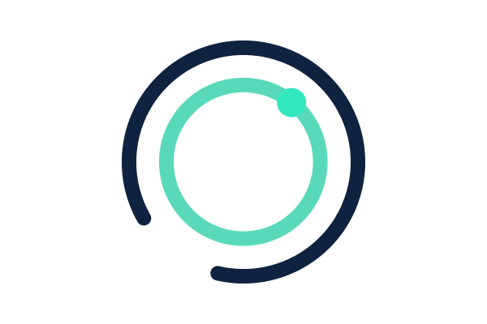

<div align="center">
  <h1>Spin</h1>
  
  <p>Spin is a framework for building, deploying, and running fast, secure, and composable cloud microservices with WebAssembly.</p>
      <a href="https://github.com/fermyon/spin/actions/workflows/build.yml"></a>
    
</div>

> This is an early preview of the Spin project. It is still experimental code,
> and you should expect breaking changes before the first stable release.

## What is Spin?

Spin is an open source framework for building and running fast, secure, and
composable cloud microservices with WebAssembly. It aims to be the easiest way
to get started with WebAssembly microservices, and takes advantage of the latest
developments in the
[WebAssembly component model](https://github.com/WebAssembly/component-model)
and [Wasmtime](https://wasmtime.dev/) runtime.

Spin offers a simple CLI that helps you create, distribute, and execute
applications, and in the next sections we will learn more about Spin
applications and how to get started.

## Getting started

See the [quickstart document](https://spin.fermyon.dev/quickstart/) for a detailed
guide on configuring Spin and writing your first Spin application, but in short:

```
$ wget https://github.com/fermyon/spin/releases/download/<version>/spin-<version>-<os-arch>.tar.gz
$ tar xfv spin-<version>-<os-arch>.tar.gz
$ ./spin --help
```

> Alternatively, you could [build Spin from source](https://spin.fermyon.dev/contributing/).

After you follow the [quickstart document](https://spin.fermyon.dev/quickstart/),
you can follow the
[Rust](https://spin.fermyon.dev/rust-components/) or [Go](https://spin.fermyon.dev/go-components/)
language guides, and the [guide on configuring Spin applications](https://spin.fermyon.dev/configuration/).

After you build your application, run it using Spin:

```
$ spin up
```

## Contributing

We are delighted that you are interested in making Spin better! Thank you!
Please follow the [contributing guide](./docs/content/contributing.md).

## Developer Meetings

Join the Spin monthly developer meetings. More info [here](https://hackmd.io/@radu/H1od0apSc).
